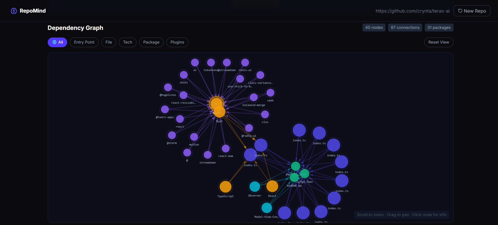
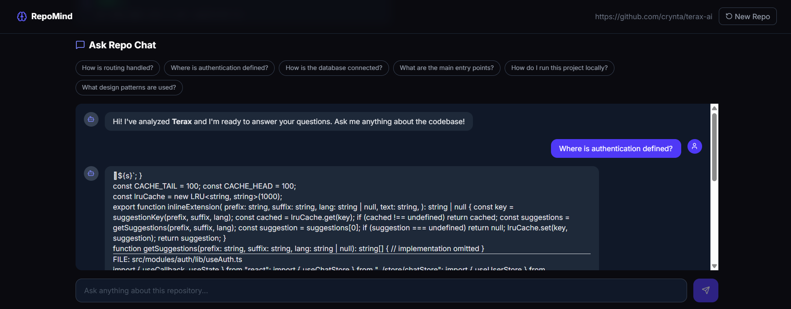
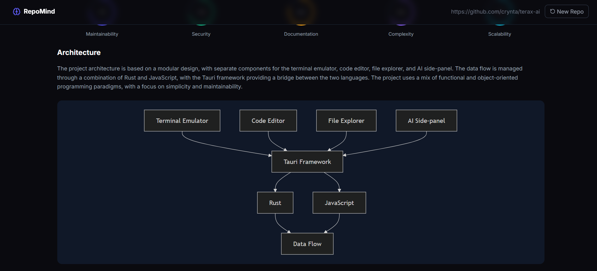
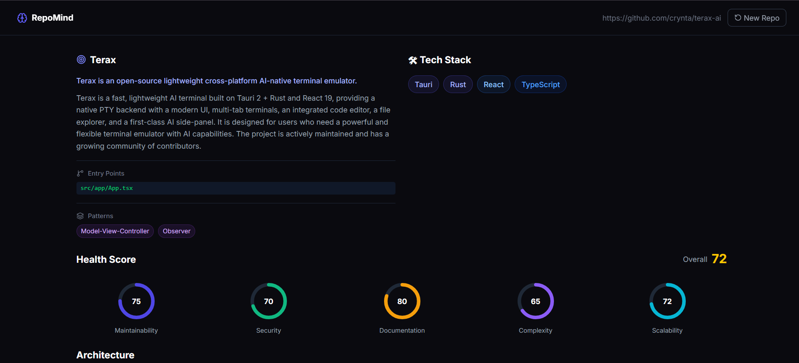

<div align="center">

<br/>


<table>
<tr>
<td align="center" width="25%">

<br/><sub><b>7 Specialized Agents</b></sub>
</td>
<td align="center" width="25%">

<br/><sub><b>Semantic Code Search</b></sub>
</td>
<td align="center" width="25%">

<br/><sub><b>Groq + Gemini</b></sub>
</td>
<td align="center" width="25%">

<br/><sub><b>Live Progress Tracking</b></sub>
</td>
</tr>
</table>

</div>

---

<div align="center">

## 🌟 What is RepoMind?

</div>

> **RepoMind** is an autonomous AI agent system that acts as a **virtual senior software engineer** for any GitHub repository. Paste a URL — and within minutes, RepoMind clones, analyzes, explains, and lets you *chat* with the entire codebase using natural language.

<div align="center">

**"From a GitHub URL to a full architectural briefing in under 2 minutes."**

</div>

<br/>

```
  GitHub URL  ──►  Clone  ──►  Scan  ──►  Parse  ──►  AI Analysis
                                                            │
                              ┌─────────────────────────────┘
                              ▼
              ┌───────────────────────────────────┐
              │        Intelligence Agent         │
              │ Architecture · Purpose · Patterns │
              └──────────────┬────────────────────┘
                             │
           ┌─────────────────┼─────────────────┐
           ▼                 ▼                 ▼
      Docs Agent       Security Agent      Q&A Agent
    README · Guide    Secrets · Vulns    RAG · Chat
           │                 │                 │
           └─────────────────┴─────────────────┘
                             │
                             ▼
                     Unified Dashboard
```

---

<div align="center">

##  Features

</div>

<table>
<tr>
<td width="50%">

###  Deep Repository Analysis
- Autonomous multi-agent pipeline
- Understands **any** public GitHub repo
- Extracts purpose, architecture, patterns
- Identifies entry points & key modules
- Detects design patterns & conventions

</td>
<td width="50%">

### AI-Powered Q&A Chat
- Chat with the codebase in natural language
- Keyword-based RAG retrieval pipeline
- Context-aware answers with file references
- Suggested questions for quick exploration
- Powered by **Groq LLaMA 3.3 70B**

</td>
</tr>
<tr>
<td width="50%">

###  Tech Stack Detection
- Automatically identifies all frameworks
- Detects languages, databases, tools
- Package manager detection
- Deployment platform recognition
- Color-coded technology badges

</td>
<td width="50%">

### Health Score Dashboard
- **Maintainability** score (0–100)
- **Security** vulnerability score
- **Documentation** quality score
- **Complexity** analysis score
- **Scalability** assessment score

</td>
</tr>
<tr>
<td width="50%">

### Interactive Dependency Graph
- Real-time D3.js Canvas visualization
- Entry points, files, packages, patterns
- Drag, zoom, and pan interactions
- Click nodes for detailed info
- Filter by node type

</td>
<td width="50%">

###  Security Scan
- Regex + LLM hybrid scanning
- Detects hardcoded secrets & API keys
- Finds dangerous function patterns
- XSS, injection vulnerability detection
- Severity-rated issue reports

</td>
</tr>
<tr>
<td width="50%">

### Auto Documentation
- Generates professional README.md
- Developer setup guide
- Architecture documentation
- Mermaid.js architecture diagrams
- Improvement suggestions

</td>
<td width="50%">
</td>
</tr>
</table>

---

<div align="center">

##  Architecture

</div>

<div align="center">

### Multi-Agent Pipeline

</div>

```
┌─────────────────────────────────────────────────────────────────┐
│                        REPOMIND SYSTEM                          │
├─────────────────────────────────────────────────────────────────┤
│                                                                 │
│   Frontend (Next.js)          Backend (Express.js)              │
│   ┌─────────────────┐         ┌──────────────────────┐          │
│   │  Landing Page   │◄───────►│  POST /api/analyze   │          │
│   │  Dashboard      │         │  GET  /api/status    │          │
│   │  Progress Track │         │  POST /api/chat      │          │
│   │  Dep. Graph     │         │  GET  /api/graph     │          │
│   │  Chat Panel     │         │  GET  /api/health    │          │ 
│   └─────────────────┘         └──────────┬───────────┘          │
│                                          │                      │
│                               ┌──────────▼───────────┐          │
│                               │     ORCHESTRATOR     │          │
│                               │   (State Machine)    │          │
│                               └──────────┬───────────┘          │
│                                          │                      │
│          ┌───────────┬──────────┬───────┴──┬──────────┐         │
│          ▼           ▼          ▼           ▼          ▼        │
│      ┌───────┐  ┌────────┐ ┌────────┐ ┌───────┐ ┌────────┐      │
│      │Clone  │  │Scanner │ │Parser  │ │Intel. │ │  Docs  │      │
│      │Agent  │  │Agent   │ │Agent   │ │Agent  │ │  Agent │      │
│      └───────┘  └────────┘ └────────┘ └───────┘ └────────┘      │
│                                                                 │
│          ┌───────────────────┐    ┌──────────────────┐          │
│          │   Security Agent  │    │    Q&A Agent     │          │
│          │  Regex + LLM Scan │    │   Keyword RAG    │          │
│          └───────────────────┘    └──────────────────┘          │
│                                                                 │
│     AI Layer:  Groq LLaMA 3.3 70B  ·  Gemini text-embedding     │
└─────────────────────────────────────────────────────────────────┘
```

---


<div align="center">

<table>
<tr>
<td align="center" colspan="2">

<tr>
<td align="center" width="50%">

### Agent Pipeline


</td>
<td align="center" width="50%">

###  Chat with Codebase


</td>
</tr>
<tr>
<td align="center" width="50%">

###  Dependency Graph


</td>
<td align="center" width="50%">

### Health Score Dashboard


</td>
</tr>
</table>

</div>
<div align="center">

##  Tech Stack

</div>

<div align="center">

### Frontend


### Backend


### AI & Intelligence


### Deployment


</div>

---

<div align="center">

##  Project Structure

</div>

```
RepoMind/
│
├── 📂 backend/
│   ├── 📄 server.js                    # Express entry point
│   ├── 📂 routes/
│   │   ├── 📄 analyze.js               # POST /analyze · GET /status
│   │   └── 📄 chat.js                  # POST /chat
│   │
│   ├── 📂 orchestrator/
│   │   └── 📄 index.js                 # Agent pipeline coordinator
│   │
│   ├── 📂 agents/
│   │   ├── 📂 cloneAgent/              # GitHub repo cloning
│   │   │   └── 📄 index.js
│   │   ├── 📂 scannerAgent/            # File tree scanner
│   │   │   └── 📄 index.js
│   │   ├── 📂 parserAgent/             # Import & export parser
│   │   │   └── 📄 index.js
│   │   ├── 📂 intelligenceAgent/       # Core AI analysis
│   │   │   ├── 📄 index.js
│   │   │   └── 📄 prompts.js
│   │   ├── 📂 docsAgent/               # Documentation generator
│   │   │   └── 📄 index.js
│   │   ├── 📂 securityAgent/           # Vulnerability scanner
│   │   │   └── 📄 index.js
│   │   └── 📂 qaAgent/                 # Q&A + RAG pipeline
│   │       ├── 📄 index.js
│   │       └── 📄 embedder.js
│   │
│   ├── 📂 services/
│   │   └── 📄 llm.js                   # Groq LLM wrapper
│   │
│   ├── 📂 utils/
│   │   ├── 📄 contextBuilder.js        # LLM context builder
│   │   ├── 📄 ignoreFilter.js          # File ignore rules
│   │   └── 📄 tokenCounter.js          # Token estimator
│   │
│   ├── 📂 cloned_repos/                # Local repo storage
│   └── 📄 .env                         # Environment variables
│
└── 📂 frontend/
    ├── 📂 app/
    │   ├── 📄 page.tsx                  # Root page
    │   ├── 📄 layout.tsx               # App layout
    │   └── 📄 globals.css              # Royal gold theme
    │
    ├── 📂 components/
    │   ├── 📄 LandingPage.tsx          # Hero + URL input
    │   ├── 📄 Dashboard.tsx            # Main report view
    │   ├── 📄 ProgressTracker.tsx      # Live step tracker
    │   ├── 📄 SummaryCard.tsx          # Project summary
    │   ├── 📄 TechStackCard.tsx        # Tech badges
    │   ├── 📄 HealthScoreCard.tsx      # Score rings
    │   ├── 📄 ArchitectureView.tsx     # Mermaid diagram
    │   ├── 📄 DependencyGraph.tsx      # D3 Canvas graph
    │   ├── 📄 FileExplorer.tsx         # Important files
    │   ├── 📄 SecurityReport.tsx       # Security issues
    │   ├── 📄 ChatPanel.tsx            # Ask Repo chat
    │   └── 📄 AnimatedBackground.tsx   # Canvas animations
    │
    ├── 📄 .env.local                   # Frontend env vars
    └── 📄 tailwind.config.ts           # Tailwind config
```

---

<div align="center">

##  Quick Start

</div>

### Prerequisites

```bash
node >= 18.0.0
npm  >= 9.0.0
git
```

### 1️⃣ Clone the Repository

```bash
git clone https://github.com/yourusername/RepoMind.git
cd RepoMind
```

### 2️⃣ Setup Backend

```bash
cd backend
npm install
```

Create `.env` file:
```env
GROQ_API_KEY=your_groq_api_key_here
GEMINI_API_KEY=your_gemini_api_key_here
PORT=3001
NODE_ENV=development
```

Start backend:
```bash
npm run dev
# RepoMind backend running on :3001
```

### 3️⃣ Setup Frontend

```bash
cd ../frontend
npm install
```

Create `.env.local` file:
```env
NEXT_PUBLIC_API_URL=http://localhost:3001
```

Start frontend:
```bash
npm run dev
#  Ready at http://localhost:3000
```

### 4️⃣ Analyze Your First Repo

Open **http://localhost:3000**, paste any GitHub URL, and click **Analyze**!

```
https://github.com/expressjs/express    ← great starter
https://github.com/fastapi/fastapi      ← Python example
https://github.com/vitejs/vite          ← modern tooling
```

---

<div align="center">

##  Getting Free API Keys

</div>

<table>
<tr>
<th>Service</th>
<th>Used For</th>
<th>Cost</th>
<th>Get Key</th>
</tr>
<tr>
<td>
  
</td>
<td>LLM inference (all AI analysis)</td>
<td>

**100% Free**

</td>
<td><a href="https://console.groq.com">console.groq.com</a></td>
</tr>
<tr>
<td>
  
</td>
<td>Text embeddings (Q&A search)</td>
<td>

**Free Tier**

</td>
<td><a href="https://aistudio.google.com">aistudio.google.com</a></td>
</tr>
</table>

> **RepoMind runs completely free** — no credit card required for the hackathon demo!

---

<div align="center">

## 📡 API Reference

</div>

### `POST /api/analyze`
Start analyzing a GitHub repository.

```json
// Request
{
  "url": "https://github.com/expressjs/express"
}

// Response
{
  "jobId": "4e7c5990-b820-4dba-9212-f409ecb4c32e"
}
```

### `GET /api/status/:jobId`
Poll the analysis progress.

```json
// Response (running)
{
  "status": "running",
  "progress": [
    { "step": "Cloning repository",  "status": "done" },
    { "step": "Scanning files",      "status": "done" },
    { "step": "Running AI analysis", "status": "running" }
  ]
}

// Response (done)
{
  "status": "done",
  "report": {
    "projectName": "express",
    "purpose": "Fast, unopinionated web framework for Node.js",
    "techStack": ["Node.js", "JavaScript", "HTTP"],
    "healthScore": {
      "maintainability": 88,
      "security": 76,
      "documentation": 95,
      "complexity": 72,
      "scalability": 90
    },
    "importantFiles": [...],
    "securityIssues": [...],
    "generatedDocs": { "readme": "...", "setupGuide": "..." }
  }
}
```

### `POST /api/chat`
Ask a question about the analyzed repository.

```json
// Request
{
  "jobId": "4e7c5990-b820-4dba-9212-f409ecb4c32e",
  "question": "How is routing handled?",
  "projectName": "express"
}

// Response
{
  "answer": "Express routing is handled through the Router class...",
  "sources": ["lib/router/index.js", "lib/router/route.js"]
}
```

### `GET /api/graph/:jobId`
Get dependency graph data for visualization.

### `GET /api/health`
Backend health check.

```json
{ "status": "ok", "timestamp": "2026-05-09T..." }
```

---

<div align="center">

##  Agent Details

</div>

<table>
<tr>
<th>Agent</th>
<th>Responsibility</th>
<th>Technology</th>
</tr>
<tr>
<td> <b>Clone Agent</b></td>
<td>Clone repos, validate URLs, manage storage</td>
<td>simple-git, GitHub API</td>
</tr>
<tr>
<td> <b>Scanner Agent</b></td>
<td>Recursive file scanning, ignore filtering, content extraction</td>
<td>Node.js fs module</td>
</tr>
<tr>
<td><b>Parser Agent</b></td>
<td>Import/export analysis, entry point detection, dependency mapping</td>
<td>Regex, AST patterns</td>
</tr>
<tr>
<td> <b>Intelligence Agent</b></td>
<td>Architecture understanding, purpose extraction, health scoring</td>
<td>Groq LLaMA 3.3 70B</td>
</tr>
<tr>
<td> <b>Docs Agent</b></td>
<td>README generation, setup guides, architecture docs, Mermaid diagrams</td>
<td>Groq LLaMA 3.3 70B</td>
</tr>
<tr>
<td><b>Security Agent</b></td>
<td>Secret detection, dangerous pattern scanning, vulnerability analysis</td>
<td>Regex + Groq LLM</td>
</tr>
<tr>
<td> <b>Q&A Agent</b></td>
<td>Natural language Q&A, keyword RAG retrieval, source attribution</td>
<td>Keyword Search + Groq</td>
</tr>
</table>

---

<div align="center">

## 🌐 Deployment

</div>

### Backend → Render

1. Push code to GitHub
2. Go to [render.com](https://render.com) → New Web Service
3. Connect your repo, set root to `backend/`
4. Build command: `npm install`
5. Start command: `node server.js`
6. Add environment variables: `GROQ_API_KEY`, `GEMINI_API_KEY`

### Frontend → Vercel

```bash
cd frontend
npx vercel --prod
```

Add environment variable in Vercel dashboard:
- `NEXT_PUBLIC_API_URL` = your Render backend URL

---

<div align="center">

## 🗺 Roadmap

</div>

- [x] Multi-agent pipeline (7 agents)
- [x] AI-powered repository analysis
- [x] Interactive dependency graph
- [x] RAG-based Q&A chat
- [x] Security vulnerability scanner
- [x] Auto documentation generation
- [x] Live progress tracking
- [x] Royal gold UI theme
- [x] Animated canvas backgrounds
- [x] Deploy to Render + Vercel
- [ ] GitHub OAuth login
- [ ] Repository history & saved analyses
- [ ] PR diff analysis ("what changed?")
- [ ] GitHub Actions bot integration
- [ ] Tree-sitter deep AST parsing
- [ ] Multi-repo comparison
- [ ] VS Code extension
- [ ] Organization-wide analytics

---

<div align="center">

## Contributing

</div>

Contributions are welcome! Here's how to get started:

```bash
# Fork the repo, then:
git clone https://github.com/Puskar2Sora/RepoMind.git
cd RepoMind
git checkout -b feature/your-amazing-feature

# Make your changes
git commit -m "feat: add amazing feature"
git push origin feature/your-amazing-feature

# Open a Pull Request 
```

Please read [CONTRIBUTING.md](CONTRIBUTING.md) for our code of conduct and contribution guidelines.

---

<div align="center">

## 📄 License

This project is licensed under the **MIT License** — see the [LICENSE](LICENSE) file for details.

---

**⭐ Star this repo if RepoMind helped you understand a codebase!**

<br/>

Made by **[PUSKAR NATH](https://github.com/Puskar2Sora)**

<br/>

[](https://github.com/Puskar2Sora)
[](https://twitter.com/Last_Safar)

</div>
